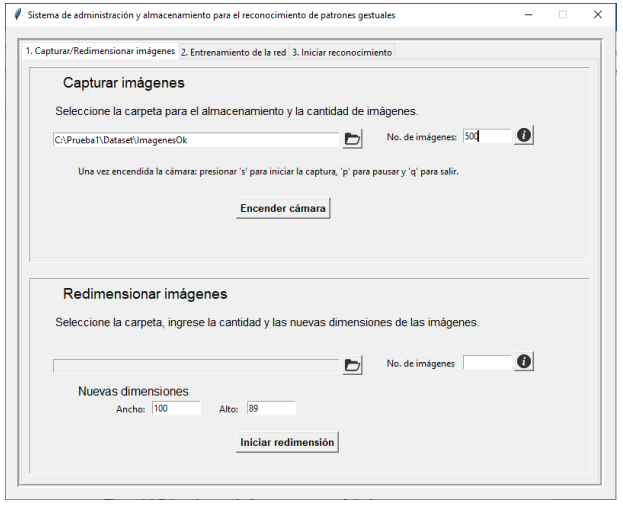
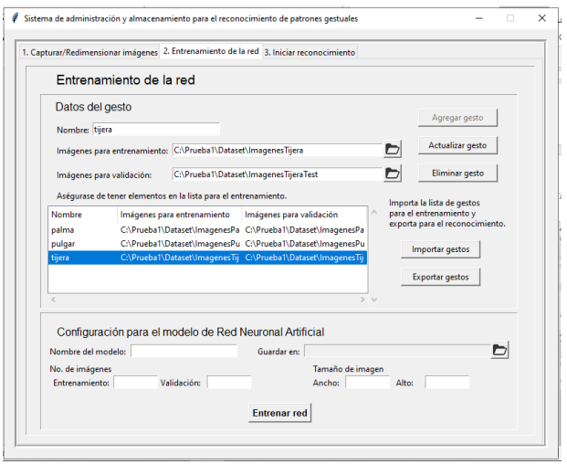

# Sistema de patrones gestuales con redes neuronales artificiales
System of gestural patterns with artificial neural networks

Este sistema captura gestos para posteriormente etiquetarlos en sus respectivas clases o categorías. Cada gesto tiene un conjunto de imágenes, estos serán entenados en un modelo de red neuronal artificial. El modelo recibe conjuntos de entrenmiento y validación, finalmente predice los gestos que están ante la cámara web.

Run main.py

## Files
- main.py
- FrameCapturaImagenes.py
- PalmTracker.py
- FrameRedimensionarImagenes.py
- ResizeImages.py
- FrameEntrenamientoRed.py
- ModelTrainer.py
- FramePredictor.py
- ContinousGesturePredictor.py

## Versions
- Jinja2	2.11.2	
- Markdown	3.2.1	
- MarkupSafe	1.1.1
- Pillow	7.0.0	
- PyWavelets	1.1.1	
- Pygments	2.6.1
- Werkzeug	1.0.0
- absl-py	0.9.0
- attrs	19.3.0
- bleach	1.5.0
- colorama	0.4.3
- cycler	0.10.0
- decorator	4.4.2	
- h5py	2.10.0	
- html5lib	0.9999999	
- imageio	2.8.0	
- importlib-metadata	1.6.0	
- imutil	0.2.0
- imutils	0.5.3
- ipython	5.0.0
- ipython-genutils	0.2.0	
- joblib	0.14.1	
- jsonschema	3.2.0	
- jupyter-core	4.6.3	
- kiwisolver	1.1.0	
- matplotlib	3.1.3	
- nbformat	5.0.6	
- networkx	2.4
- numpy	1.18.1
- opencv-python	3.4.9.31
- pickleshare	0.7.5
- pip	18.1
- prometheus-client	0.7.1
- prompt-toolkit	1.0.18
- protobuf	3.11.3
- pyparsing	2.4.6	
- pyrsistent	0.16.0
- python-dateutil	2.8.1
- pywin32	227
- pywinpty	0.5.7
- scikit-image	0.16.2
- scikit-learn	0.22.2.post1
- scipy	1.4.1
- setuptools	40.6.2
- simplegeneric	0.8.1
- six	1.14.0
- sklearn	0.0
- tensorflow	1.5.0	
- tensorflow-tensorboard	1.5.1
- terminado	0.8.3
- tflearn	0.3.2
- tornado	6.0.4
- traitlets	4.3.3
- wcwidth	0.1.9
- wheel	0.34.2
- win-unicode-console	0.5	
- windows-curses	2.1.0
- zipp	3.1.0
